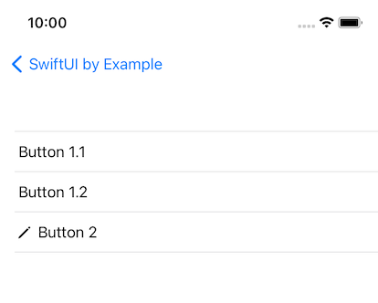
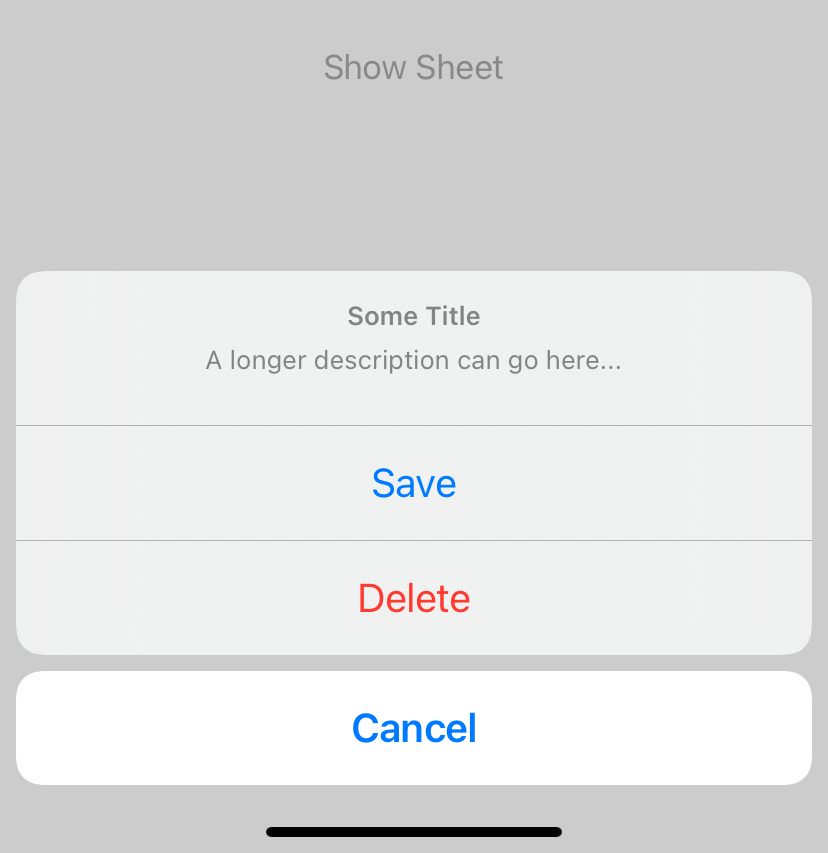

# SwiftUI-by-Example

SwiftUI by Example is an Universal App for iOS and MacOS containing the following examples:

- Example 1: Buttons [doc.](https://developer.apple.com/documentation/swiftui/button) 
  - 
- Example 2: ActionSheet [doc.](https://developer.apple.com/documentation/swiftui/actionsheet) 
  - 
- Example 3: Open a Sheet with a new view and dismiss again

